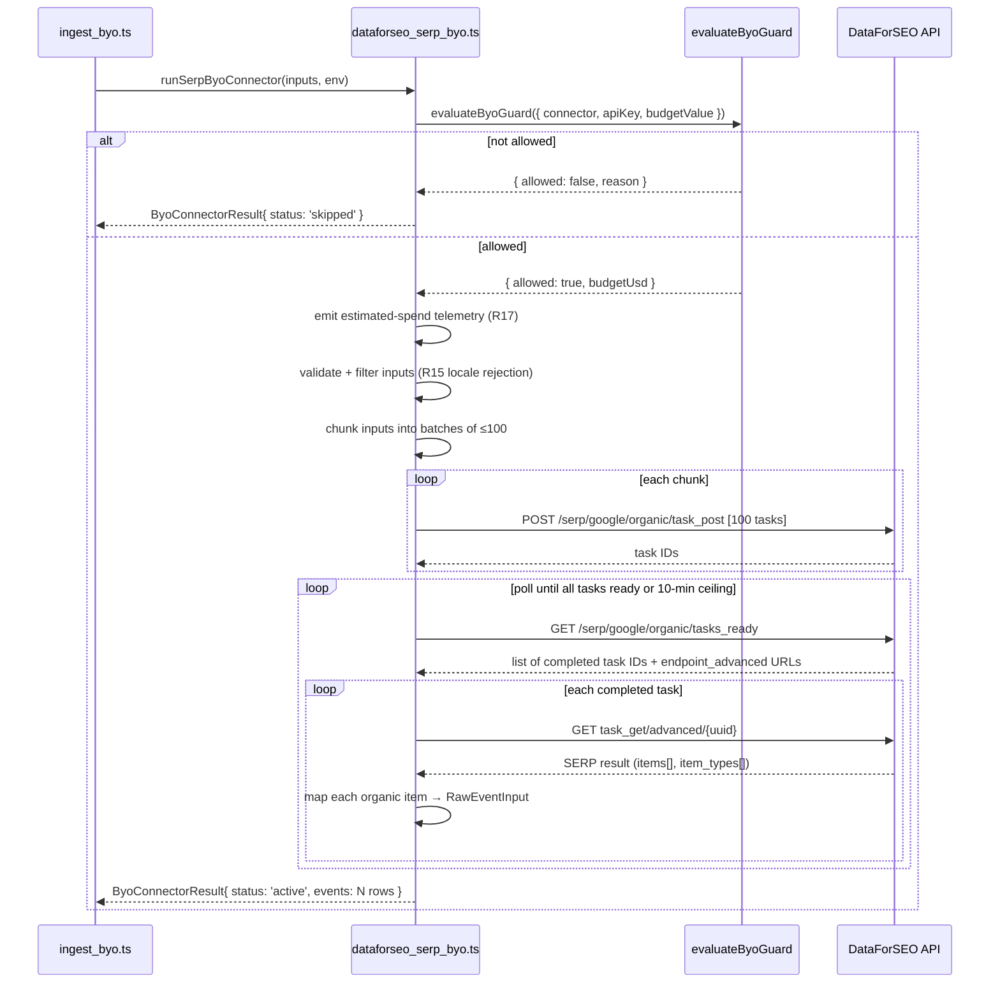

# feat: Add DataForSEO SERP BYO Connector

## Overview

Adds a new BYO connector (`dataforseo_serp_byo.ts`) that fetches Google SERP data — organic results, AI Overview presence, People-Also-Ask entries, and SERP feature flags — per `(keyword, country, language)` tuple using DataForSEO's async/queued API. The connector feeds the Country × Niche Selection Engine's SERP-weakness and AIO-survival scoring paths and is sequenced in Wave 2 of the boring-websites integration build plan.

## Problem Frame

The Country × Niche matrix scorer needs per-keyword SERP data to distinguish wide-open niches from incumbent-saturated ones — the single signal Feynman 2026 research identifies as gating viable vs. dead candidates post-HCU. Existing connectors cover demand-shape (Google Trends), news (Perigon BYO), and neural web search (Exa BYO), but none expose parsed Google SERP listings with country + language targeting. Without this signal, AIO-answerability scoring and competitor identification are impossible.

Target user: the solo operator scanning the Country × Niche matrix dashboard. Affected components: `packages/connectors/`, `apps/api/src/jobs/ingest_byo.ts`, downstream scorers consuming `RawEventInput`.

(see origin: `docs/brainstorms/2026-04-24-keyword-serp-signals-requirements.md`)

## Requirements Trace

- **R1.** Return top-N organic SERP results per `(keyword, country_code, language)` tuple (depth configurable, default 10, max 100).
- **R2.** Capture AIO presence and parsed content (cited sources, text blocks) when displayed.
- **R3.** Capture PAA entries (question + answer snippet) when present.
- **R4.** Capture featured snippet, knowledge panel, and shopping/ads block presence flags (binary).
- **R5.** Record fetch timestamp and DataForSEO task ID for dedupe and provenance.
- **R6.** BYO pattern: `DATAFORSEO_API_KEY` env var (base64 Basic Auth credential), `DATAFORSEO_DAILY_BUDGET_USD` daily spend guard.
- **R7.** Connector must be skippable (not errored) when credentials or budget are absent.
- **R8.** Emit telemetry identical in shape to existing BYO telemetry.
- **R9.** Default vendor DataForSEO; interface vendor-agnostic at the `runSerpByoConnector` boundary.
- **R10.** Batch ingestion support — async/queued endpoint for ~1000–2000 queries per refresh.
- **R11.** Single `runSerpByoConnector(inputs: SerpQuery[], env?, loader?)` exported entry point.
- **R12.** Batch results emitted as individual `RawEventInput` rows per `(keyword, country, language, result_position)`.
- **R13.** Accept ISO country codes; map to DataForSEO `location_code` / `language_code`.
- **R14.** Coverage target: ~50 countries from the Language-First Pruning Gate candidate set.
- **R15.** Reject unsupported `(country, language)` pairs with telemetry reason `unsupported_locale`.
- **R16.** Daily USD budget enforced via existing BYO guard.
- **R17.** Emit estimated-spend preview telemetry before issuing vendor calls.
- **R18.** Configurable batch-size cap per run (`DATAFORSEO_MAX_BATCH_PER_RUN`, default 500).
- **R19.** Each emitted event carries `position`, `domain`, `aio_present`, `paa_present` flags for downstream scorers.
- **R20.** DataForSEO `task_id` preserved as `source_item_id` (30-day re-fetch window); SERP signals stored in `metadata`.
- **R21.** Unit tests: mock HTTP layer, guard paths, batch-to-events transform, country/language mapping.
- **R22.** At least one non-English locale fixture (German, Polish, or Portuguese-BR).

**Success criteria carried forward:**
- Connector runs without error against a provided `SerpQuery[]` input and emits correctly-shaped `RawEventInput` rows. (Full matrix scorer non-null output is a Wave 2 milestone gate, deferred until `SerpQuery[]` population via Language-First Pruning Gate.)
- Full matrix refresh (~60 pairs × ~20 keywords = 1200 queries at **default depth 10**) costs under $5 of DataForSEO spend. At depth 100, cost is ~$5.58; operator chooses which target to satisfy.
- Connector disabled (no `DATAFORSEO_API_KEY`) without breaking any pipeline or UI component.
- Swapping DataForSEO for SerpAPI requires changing one connector implementation file and the env var name.

## Scope Boundaries

- **Out:** Keyword search volume, keyword difficulty, competitive density, related-keyword discovery.
- **Out:** Branded-query / owned-site tracking via Google Search Console.
- **Out:** LLM citation monitoring (ChatGPT / Perplexity / Gemini) — survivor #6's separate connector.
- **Out:** Multi-vendor switch (Approach C) — interface stays swappable but only DataForSEO implemented now.
- **Out:** Page-content fetching of ranked URLs.
- **Out:** Retroactive SERP history backfill.
- **Out:** Persistent spend tracking. **R16 clarification:** `evaluateByoGuard` checks `spentUsd >= budgetUsd`; without a spend store, `spentUsd` is always `0`, so the guard only enforces credential presence — not true daily spend. `DATAFORSEO_DAILY_BUDGET_USD` is wired but has no enforcement effect until a spend-store service ships. Operator must rely on `DATAFORSEO_MAX_BATCH_PER_RUN` as the primary cost control in v1.
- **Out:** Language-First Pruning Gate (`SerpQuery[]` seeded manually or from config until the gate ships).

### Deferred to Separate Tasks

- Persistent daily spend tracking and hard-stop enforcement: separate spend-store service (future Wave 2+ task).
- `SerpQuery[]` population from Country × Niche matrix (depends on Language-First Pruning Gate — Mechanism B, Wave 1).
- People-Also-Ask click-depth expansion (PAA click depth 1–4 at +$0.00015/click each): separate operator configuration.

## Context & Research

### Relevant Code and Patterns

- `packages/connectors/src/byo_guard.ts` — `evaluateByoGuard`, `ByoConnectorResult`, `ConnectorTelemetry` types; the mandatory guard pattern.
- `packages/connectors/src/exa_byo.ts` — primary BYO connector shape: private loader function + exported runner + guard-first early return.
- `packages/connectors/src/twitter_byo.ts` — multi-query loop pattern (iterate inputs, push to results, catch per-query errors silently). Most applicable for the SERP batch loop.
- `packages/connectors/src/perigon_byo.ts` — secondary BYO reference.
- `packages/connectors/src/common/http.ts` — `RawEventInput` type, `fetchJsonWithRetry`, `withRetry`. **Note:** `RawEventInput` currently has no `metadata` field — Unit 1 adds it.
- `packages/connectors/tests/` — Vitest test patterns for BYO connectors (mock HTTP via `vi.fn()`, injectable loader).
- `apps/api/src/jobs/ingest_byo.ts` — scheduler; imports BYO runners by direct path; `Promise.all()` + `runSafely()` pattern; `deps` injection for testability.
- `apps/api/tests/ingest-byo-resilience.test.ts` — isolation tests per connector; must add a `dataforseo_serp_byo` failure-isolation case.

### Institutional Learnings

- No `docs/solutions/` directory exists yet. No prior connector learnings documented.
- Existing BYO connectors are synchronous. DataForSEO async endpoint is a first-in-codebase polling pattern.

### External References

- DataForSEO SERP async endpoint: POST `https://api.dataforseo.com/v3/serp/google/organic/task_post` (array up to 100 tasks), then GET `tasks_ready` → per-task `task_get/advanced/{uuid}`.
- Authentication: HTTP Basic Auth only — `DATAFORSEO_API_KEY` = `base64("login:password")`.
- `load_async_ai_overview: true` required per task to capture async-loaded AIO; costs +$0.0006/task (refunded if AIO absent).
- `item_types: string[]` array on each result is the fast SERP-feature presence check (`"ai_overview"`, `"people_also_ask"`, `"featured_snippet"`, `"knowledge_graph"`, `"shopping"`, `"paid"`).
- PAA in `items[]` as `type: "people_also_ask"` nested elements.
- Standard queue: ~$0.0006 per task (10 results); depth 100 = ~$0.00465/task. Default depth 10 keeps 1200-query refresh at ~$0.72 (well under $5 target).
- 100 tasks per POST max (error `40006` if exceeded).
- Results available for 30 days post-completion. `task_id` UUID is the provenance handle.
- Location/language lookup CSVs available from DataForSEO CDN (see Operational Notes).
- `tag: string` field (255 chars) per POST task — use to embed internal `(keyword, country, language)` tuple for correlation.

## Key Technical Decisions

- **`RawEventInput` extended with optional `metadata?: Record<string, unknown>`** (backwards-compatible additive change). SERP-specific signals (`aio_present`, `paa_present`, `featured_snippet_present`, `knowledge_panel_present`, `shopping_ads_present`, `organic_position`, `domain`) populate this field. Existing connectors and downstream consumers unaffected. (see origin: R12, R19, R20)

- **`DATAFORSEO_API_KEY` = base64(login:password)** matches the BYO `{VENDOR}_API_KEY` env-var pattern. Connector sets `Authorization: Basic ${apiKey}` header. No deviation from guard interface needed.

- **Configurable SERP depth via `DATAFORSEO_SERP_DEPTH` env var, default 10.** Default satisfies the $5/day success criterion for a 1200-query refresh. R1's top-100 achievable by operator setting `DATAFORSEO_SERP_DEPTH=100` at ~$5.58/refresh. This makes the tension explicit rather than silently violating either the $5 target or R1.

- **Always pass `load_async_ai_overview: true`.** AIO-Survival Scorer's thesis requires reliable AIO detection. Without this flag, async-loaded AIO (the majority) is missed. Cost at depth 10 + AIO = ~$0.0012/query.

- **DataForSEO `task_id` as `source_item_id`** — serves as R20 provenance reference. DataForSEO retains results 30 days. Format: `dataforseo:{task_id}:{rank_absolute}` where `rank_absolute` is DataForSEO's 1-based absolute position field (not `rank_group`). Guarantees uniqueness per organic result within a task.

- **`text` = `"${title}\n${snippet}"`** — matches the Exa BYO pattern; feeds entity extraction with maximal signal.

- **In-process polling loop, 10-minute ceiling.** No pingback URL (requires public ingress idea.ai lacks). Poll `tasks_ready` every 30 seconds with exponential backoff. On timeout, return partial results with telemetry reason `poll_timeout`. Task IDs are in-memory only — no cross-run recovery.

- **Internal POST chunk size = 100** (DataForSEO maximum). `DATAFORSEO_MAX_BATCH_PER_RUN` (default 500) caps total queries per invocation. Full 1200-query matrix can run by setting to 1200 or in multiple invocations.

- **R17 spend preview is informational only in v1.** Estimated spend emitted as telemetry before calls. No blocking enforcement. Spend-store service deferred. **Correct formula:** `estimated_cost = inputs.length × (base_cost_per_task + 0.0006_aio)` where `base_cost_per_task` is tiered by depth (depth 10 = $0.0006; depth 100 = $0.00465). Do NOT multiply by depth as a linear factor — cost is per-task not per-result.

- **`ByoSkipReason` extended in `byo_guard.ts`** to include `'unsupported_locale' | 'poll_timeout'`. Both are valid connector-level skip/partial states and are used as `reason` values in `ByoConnectorResult`. This is a backwards-compatible union extension.

- **`SerpConnectorResult` type defined locally in `dataforseo_serp_byo.ts`** extending `ByoConnectorResult` with `locale_rejections?: Array<{country_code: string; language_code: string}>` and `poll_summary?: {total: number; retrieved: number; timed_out: boolean}`. Return type of `runSerpByoConnector` is `Promise<SerpConnectorResult>`. Scheduler wires it via closure (see Unit 4) so `ConnectorExecutor` type is satisfied.

- **`ConnectorExecutor` signature satisfied via closure wrapper in Unit 4.** `ingest_byo.ts` defines `ConnectorExecutor = (env) => Promise<ByoConnectorResult>`. Since `runSerpByoConnector` takes `(inputs, env?, loader?)`, Unit 4 registers it as `(env) => runSerpByoConnector(serpInputs, env)` — a closure that captures `serpInputs`. `SerpConnectorResult` extends `ByoConnectorResult` so the return type is assignable.

- **`paa_entries` and `aio_text` duplicated on ALL organic result rows** — not just position 1. This is the "self-contained" contract: every row is scorable without a positional join. The payload cost is small (AIO text typically < 1 KB). Scorers MUST NOT assume these fields are null for positions > 1.

- **`COST_PER_CALL` entry for `dataforseo_serp_byo` in `ingest_byo.ts` set to `0`.** DataForSEO cost is variable (function of batch size × depth × AIO flag); the static `COST_PER_CALL` pattern cannot express it accurately. Set to `0` as an explicit sentinel and add a code comment noting real cost is tracked via R17 spend-preview telemetry until a spend-store service ships.

- **Committed JSON lookup file for location mapping** (`packages/connectors/src/dataforseo_location_map.json`). Generated once from DataForSEO's CSV; checked into the repo. Covers ~50 Language-First Pruning Gate candidate countries.

## Open Questions

### Resolved During Planning

- **Type extension approach (C1):** Add `metadata?: Record<string, unknown>` to `RawEventInput` — backwards-compatible, no downstream breakage.
- **Auth shape:** `DATAFORSEO_API_KEY` = base64(login:password); connector assembles Basic Auth header internally.
- **`text` field content:** `"${title}\n${snippet}"` per organic row.
- **Spend enforcement in v1:** Credential-presence guard only (`spentUsd` always 0 without spend store). `DATAFORSEO_DAILY_BUDGET_USD` has no enforcement effect in v1. `DATAFORSEO_MAX_BATCH_PER_RUN` is the primary cost control.
- **`engagement_count` mapping:** Leave `undefined` — no natural SERP analog.
- **Depth vs. cost tension:** Configurable depth (default 10). Success criterion scoped to depth 10. R1 top-100 is operator opt-in at higher cost. Both constraints documented explicitly.
- **AIO capture cost:** Accepted — `load_async_ai_overview: true` always; AIO-Survival Scorer requires it.
- **`paa_entries`/`aio_text` duplication:** All organic rows carry both — self-contained contract, no positional join.
- **`ByoSkipReason` extension:** Add `'unsupported_locale' | 'poll_timeout'` to union in `byo_guard.ts`.
- **`SerpConnectorResult` type:** Local extension of `ByoConnectorResult` with locale_rejections + poll_summary.
- **`ConnectorExecutor` wrapper:** Register via closure `(env) => runSerpByoConnector(serpInputs, env)`.
- **`COST_PER_CALL` sentinel:** Set to `0` with comment explaining variable-cost nature.
- **Refresh cadence:** Weekly — matches matrix scorer refresh. Operator can trigger on-demand. Monthly cost at weekly cadence + depth 10 + 1200 queries = ~$3/month.
- **R17 spend formula:** Per-task tiered pricing, not per-result. Corrected formula in Key Technical Decisions.
- **`source_item_id` position field:** `rank_absolute` (1-based, DataForSEO's absolute SERP position).
- **R20 storage shape:** `metadata.serp_raw_response` not added; instead `source_item_id` = task_id:rank_absolute provides a 30-day provenance handle. Metadata carries the signal fields needed for scoring. Full re-fetch from DataForSEO is the re-parse path.
- **Scorer interface (R19):** AIO-Survival Scorer not yet implemented; R19 fields are planned against anticipated inputs. If scorer design changes materially, R19 may need revision (already noted as assumption in origin doc).

### Deferred to Implementation

- **Exact `location_code` values for all 50 operator countries:** Pull from DataForSEO CSV during implementation; commit lookup JSON.
- **Poll interval tuning:** Start at 30s; real DataForSEO turnaround may suggest faster/slower. Adjust based on observed behavior.
- **`fallbackBudget` value for `evaluateByoGuard`:** Set to 5 (matching existing connectors) for the guard's "no budget configured" default.
- **`SerpQuery[]` seed before Language-First Pruning Gate ships:** Implement must accept empty input gracefully AND provide a minimal hardcoded smoke-test fixture (≥1 keyword tuple) for criterion validation.
- **Partial poll timeout behavior:** Default to partial return. Confirm operator expectations after first real batch.

## High-Level Technical Design

> *This illustrates the intended approach and is directional guidance for review, not implementation specification. The implementing agent should treat it as context, not code to reproduce.*

### Async SERP Connector Flow



### Event Shape Per Organic Result Row

Each organic SERP result emits one `RawEventInput` with:

```
source:            "dataforseo_serp"
source_item_id:    "dataforseo:{task_id}:{rank_absolute}"  // rank_absolute is 1-based absolute SERP position
source_timestamp:  ISO 8601 fetch time
text:              "${title}\n${snippet}"
url:               result URL
metadata: {
  keyword:                  string
  country_code:             string   // ISO
  language_code:            string
  organic_position:         number
  domain:                   string
  aio_present:              boolean
  paa_present:              boolean
  featured_snippet_present: boolean
  knowledge_panel_present:  boolean
  shopping_ads_present:     boolean
  aio_text:                 string | null   // parsed AIO body when present
  paa_entries:              Array<{ question, snippet }> | null
  item_types:               string[]        // raw DataForSEO item_types array
}
```

Query-level context (AIO, PAA, SERP features) is **duplicated across ALL position rows** from the same query — every row is self-contained for downstream scoring without a join. `aio_text` and `paa_entries` are NOT restricted to position 1; scorers must not assume these fields are null for positions > 1.

## Implementation Units

- [x] **Unit 1: Extend shared types for SERP connector**

  **Goal:** Make two backwards-compatible type changes that unblock Unit 3: add `metadata` to `RawEventInput` and extend `ByoSkipReason` with SERP-specific reason values.

  **Requirements:** R12, R15, R19, R20

  **Dependencies:** None

  **Files:**
  - Modify: `packages/connectors/src/common/http.ts`
  - Modify: `packages/connectors/src/byo_guard.ts`

  **Approach:**
  - `common/http.ts`: Add `metadata?: Record<string, unknown>` as the last field in `RawEventInput`. No other changes — existing connectors and downstream consumers unaffected.
  - `byo_guard.ts`: Extend `ByoSkipReason` union to include `'unsupported_locale' | 'poll_timeout'`. These are used by the SERP connector when rejecting unsupported locales (R15) and when the polling ceiling is exceeded. Existing connectors only use `'missing_credentials'` and `'budget_exhausted'` — the extension does not affect them.

  **Patterns to follow:**
  - `packages/connectors/src/common/http.ts` — existing `RawEventInput` type shape.
  - `packages/connectors/src/byo_guard.ts` — existing `ByoSkipReason` union.

  **Test scenarios:**
  - Test expectation: none — pure type extensions with no behavioral change. TypeScript compiler verifies backwards compatibility.

  **Verification:**
  - `RawEventInput` type accepts a `metadata` object when present.
  - `ByoSkipReason` type includes `'unsupported_locale'` and `'poll_timeout'` as valid values.
  - Existing BYO connector unit tests still pass without modification.
  - `tsc --noEmit` clean across all packages.

---

- [x] **Unit 2: DataForSEO location/language lookup file**

  **Goal:** Commit a static JSON mapping from ISO country code → DataForSEO `{ location_code, language_code }` covering the ~50 Language-First Pruning Gate candidate countries, and export a lookup helper function.

  **Requirements:** R13, R14, R15

  **Dependencies:** Unit 1

  **Files:**
  - Create: `packages/connectors/src/dataforseo_location_map.json`
  - Create: `packages/connectors/src/dataforseo_location_helpers.ts`
  - Test: `packages/connectors/tests/dataforseo_location_helpers.test.ts`

  **Approach:**
  - JSON file: keyed by ISO country code (`"DE"`, `"PL"`, `"BG"`, `"PT"`, `"US"`, `"BR"`, etc.), value `{ location_code: number, language_code: string }`.
  - For multi-language countries (e.g., Switzerland — DE/FR/IT), include one entry per operator-relevant language variant, keyed as composite `"CH_DE"`, `"CH_FR"`, etc.
  - Helper exports `lookupDataForSeoLocale(country_code: string, language_code: string)` → `{ location_code, language_code } | null`.
  - Returning `null` triggers R15 telemetry rejection in the connector.
  - Initial values derived from DataForSEO's CSV lookup (see Operational Notes). Exact codes resolved during implementation.

  **Patterns to follow:**
  - Committed JSON config pattern — no runtime API calls for this lookup.

  **Test scenarios:**
  - Happy path: known ISO code (`"DE"`, `"PL"`, `"BR"`) → returns correct `{ location_code, language_code }`.
  - Edge case: unknown ISO code → returns `null`.
  - Edge case: `"pt-BR"` composite style input → consider normalization in helper, return Brazil entry.
  - Edge case: case-insensitive input (`"de"` vs `"DE"`) → normalize to uppercase before lookup.

  **Verification:**
  - At least 50 country entries in the JSON file.
  - All entries have numeric `location_code` and non-empty `language_code`.
  - Helper unit tests pass.

---

- [x] **Unit 3: DataForSEO SERP BYO connector core**

  **Goal:** Implement `dataforseo_serp_byo.ts` following the BYO connector pattern with async POST → poll → fetch loop, batch chunking, result mapping to `RawEventInput`, R15 locale rejection, and R17 spend preview.

  **Requirements:** R1–R12, R15–R22

  **Dependencies:** Units 1, 2

  **Files:**
  - Create: `packages/connectors/src/dataforseo_serp_byo.ts`
  - Test: `packages/connectors/tests/dataforseo_serp_byo.test.ts`

  **Approach:**
  - Export `SerpQuery` type: `{ keyword: string; country_code: string; language_code: string }`.
  - Define `SerpConnectorResult` extending `ByoConnectorResult` with `locale_rejections?: Array<{country_code: string; language_code: string}>` and `poll_summary?: {total: number; retrieved: number; timed_out: boolean}`. Return type of `runSerpByoConnector` is `Promise<SerpConnectorResult>`.
  - Export `runSerpByoConnector(inputs: SerpQuery[], env?: NodeJS.ProcessEnv, loader?: typeof defaultLoader): Promise<SerpConnectorResult>`.
  - Guard first: `evaluateByoGuard({ connector: 'dataforseo_serp_byo', apiKey: env.DATAFORSEO_API_KEY, budgetValue: env.DATAFORSEO_DAILY_BUDGET_USD, fallbackBudget: 5 })`. Early-return `{ status: 'skipped' }` if not allowed.
  - R17: compute and emit estimated spend as telemetry before calls (not blocking). **Correct formula:** `inputs.length × (base_cost + 0.0006_aio)` where `base_cost` is tiered by depth (depth 10 → $0.0006; depth 100 → $0.00465). Do NOT multiply by depth linearly — cost is per-task, not per-result.
  - R15: validate each input through `lookupDataForSeoLocale`; separate into valid/invalid. Collect rejected locales into `locale_rejections` array on result. Continue with valid subset.
  - R18: cap valid inputs to `DATAFORSEO_MAX_BATCH_PER_RUN` (default 500) before processing.
  - Task posting: chunk valid inputs into arrays of 100; POST each chunk to DataForSEO async endpoint. Embed `tag: "${keyword}|${country_code}|${language_code}"` on each task for correlation. Set `depth: parseInt(env.DATAFORSEO_SERP_DEPTH ?? '10')` and `load_async_ai_overview: true` on each task.
  - Polling loop: call `tasks_ready` every 30 seconds with exponential backoff (cap at 120s). The `sleep` helper is not exported from `common/http.ts` — define a local `sleep` in the connector file. Track which task IDs have been retrieved. Exit when all task IDs retrieved OR 10-minute wall-clock ceiling exceeded. On ceiling, emit `poll_timeout` in telemetry and set `poll_summary.timed_out: true` on the result.
  - Result mapping: for each completed task, extract `item_types[]`, AIO item, PAA items, featured snippet flag, knowledge panel flag, shopping/ads flag. For each organic result item (type `"organic"`), emit one `RawEventInput` row. **All rows carry `aio_text` and `paa_entries`** — not just position 1. Use `rank_absolute` (1-based) for `source_item_id` position field.
  - **Credential logging guard:** error handlers must NEVER include `Authorization` header or raw `DATAFORSEO_API_KEY` value in telemetry or logs. Per-task error logging includes task ID and status code only.
  - Injectable loader follows `exa_byo.ts` pattern for testability.

  **Execution note:** Write a failing integration test against the mock HTTP layer for the full POST → poll → fetch lifecycle before implementing the polling loop.

  **Patterns to follow:**
  - `packages/connectors/src/twitter_byo.ts` — multi-query loop with per-query error catch.
  - `packages/connectors/src/exa_byo.ts` — guard-first runner + injectable loader.
  - `packages/connectors/src/common/http.ts` — `withRetry` for HTTP-level retries (not for polling — polling needs its own interval logic).

  **Test scenarios:**
  - Happy path: valid inputs, mock guard allows, mock `task_post` returns task IDs, mock `tasks_ready` returns completed IDs after 1 poll, mock `task_get` returns fixture SERP response → emitted events have correct shape, `status: 'active'`.
  - Happy path: fixture includes AIO item → `metadata.aio_present: true`, `metadata.aio_text` non-null.
  - Happy path: German fixture (R22) — verify `metadata.country_code: 'DE'`, non-ASCII characters preserved in `text`.
  - Happy path: Polish fixture (R22 alternative) — `metadata.country_code: 'PL'`.
  - Guard path: missing `DATAFORSEO_API_KEY` → `status: 'skipped'`, `reason: 'missing_credentials'`, zero events.
  - Guard path: budget exhausted → `status: 'skipped'`, `reason: 'budget_exhausted'`, zero events.
  - R15 locale rejection: input with unsupported country code → that query excluded from POST, telemetry entry emitted with `reason: 'unsupported_locale'`, valid inputs proceed.
  - R18 batch cap: inputs > `MAX_BATCH_PER_RUN` → only first N inputs processed, telemetry shows cap applied.
  - Poll timeout: mock `tasks_ready` never returns all IDs → after ceiling, partial results returned with `poll_timeout` telemetry.
  - Per-query error: mock `task_get` returns `status_code: 40000` for one task → that task skipped, others processed, run continues.
  - R17 preview: estimated spend emitted as telemetry before any POST calls.
  - SERP features: fixture with `item_types: ["featured_snippet", "knowledge_graph", "shopping"]` → corresponding `metadata` boolean flags `true`.
  - `source_item_id` format: verify `"dataforseo:{task_id}:{rank_absolute}"` per organic row; `rank_absolute` matches DataForSEO's 1-based field, not array index.
  - All rows carry `aio_text`/`paa_entries`: fixture with 3 organic results → all 3 have non-null `metadata.aio_text` when AIO present, not just position 1.
  - Depth config: `DATAFORSEO_SERP_DEPTH=5` → POST tasks have `depth: 5`.
  - `engagement_count` undefined on all emitted events.
  - `load_async_ai_overview: true` present on every posted task.

  **Verification:**
  - All guard skip paths return `events: []`.
  - Each organic result row has `source: "dataforseo_serp"`, `url`, `text`, populated `metadata`.
  - Non-English locale fixtures round-trip without encoding errors.
  - All test scenarios pass.

---

- [x] **Unit 4: Wire connector into ingestion scheduler**

  **Goal:** Register `runSerpByoConnector` in `ingest_byo.ts` so the scheduler invokes it as part of the BYO connector batch.

  **Requirements:** R10, R11

  **Dependencies:** Units 1, 2, 3

  **Files:**
  - Modify: `apps/api/src/jobs/ingest_byo.ts`

  **Approach:**
  - Import `runSerpByoConnector` and `SerpQuery` from `@idea/connectors/src/dataforseo_serp_byo`.
  - Add `dataforseo_serp_byo` to the connector name union and `deps` injection interface.
  - **`ConnectorExecutor` compatibility:** `ingest_byo.ts` defines `ConnectorExecutor = (env) => Promise<ByoConnectorResult>`. Register SERP connector as a closure: `(env) => runSerpByoConnector(serpInputs, env)`. `serpInputs: SerpQuery[]` is captured from the job's parameter. `SerpConnectorResult` extends `ByoConnectorResult` so the return type is assignable.
  - `serpInputs` default: empty `[]` until Language-First Pruning Gate ships. Also commit a minimal hardcoded smoke-test fixture (≥1 keyword tuple, e.g., `[{ keyword: 'salary calculator', country_code: 'DE', language_code: 'de' }]`) for criterion validation — separate from the production empty default.
  - **`COST_PER_CALL` entry:** Add `dataforseo_serp_byo: 0` to the existing `COST_PER_CALL` map. Set to `0` explicitly as a sentinel — cost is variable (batch size × depth × AIO flag) and cannot be expressed as a static constant. Add a code comment explaining this and referencing R17 spend-preview telemetry as the cost visibility mechanism until a spend-store service ships.
  - **`spendStore` ternary:** Extend the per-connector `apiKey`/`budgetValue` env-var ternary at the existing `spendStore` pre-check path (lines ~81–82) with `DATAFORSEO_API_KEY` / `DATAFORSEO_DAILY_BUDGET_USD` for the new connector key.
  - Add `dataforseo_serp_byo` result to the job's result shape and telemetry aggregation.
  - Do not introduce new scheduling logic — ride the existing cadence.

  **Patterns to follow:**
  - `apps/api/src/jobs/ingest_byo.ts` — existing connector registration pattern (`deps`, `Promise.all`, `runSafely`, `COST_PER_CALL`, spendStore ternary).

  **Test scenarios:**
  - Integration: scheduler invoked with `serpInputs: []` → connector called, returns `status: 'skipped'` or `status: 'active'` with zero events, scheduler result includes `dataforseo_serp_byo` key.
  - Connector failure isolation: mock `runSerpByoConnector` throws → other connectors still complete, scheduler returns partial result.

  **Verification:**
  - `ingest_byo.ts` TypeScript type-checks with new connector added.
  - Existing scheduler tests still pass.
  - New connector appears in scheduler result under `dataforseo_serp_byo` key.

---

- [x] **Unit 5: Resilience test isolation case**

  **Goal:** Add a failure-isolation test case for `dataforseo_serp_byo` to `ingest-byo-resilience.test.ts` verifying the connector's failure does not abort the full scheduler run.

  **Requirements:** R7

  **Dependencies:** Unit 4

  **Files:**
  - Modify: `apps/api/tests/ingest-byo-resilience.test.ts`

  **Approach:**
  - Follow the `vi.doMock` + `vi.resetModules()` + dynamic `await import()` pattern used for existing connectors.
  - Mock `@idea/connectors/src/dataforseo_serp_byo` to throw an unhandled error.
  - Assert: other connectors still run and return results; overall scheduler result shape is intact.

  **Patterns to follow:**
  - `apps/api/tests/ingest-byo-resilience.test.ts` — existing isolation test structure for exa/perigon/twitter.

  **Test scenarios:**
  - `runSerpByoConnector` throws synchronously → scheduler completes without throwing, other connector results present.
  - `runSerpByoConnector` rejects with a Promise → same assertion.

  **Verification:**
  - Test added, passes, existing resilience cases still pass.

## System-Wide Impact

- **Interaction graph:** `ingest_byo.ts` scheduler invokes the connector; `entity_extractor.ts` processes emitted `RawEventInput` rows downstream. The `metadata` field is opaque to the extractor — no changes needed.
- **Trust boundary — SERP text and LLM prompt injection:** `RawEventInput.text` (`title\nsnippet`) and `metadata.aio_text` are attacker-influenceable content — adversarial SEO can place arbitrary text in indexed page titles, snippets, and AI Overviews. The entity extractor is LLM-based and constructs its prompt by appending raw signal text. To reduce prompt injection surface: (1) cap `metadata.aio_text` to 4 KB before writing; (2) strip or truncate excessively long titles/snippets before constructing `text`; (3) treat all SERP-origin strings as untrusted user data at the extraction boundary. See Risks table.
- **Error propagation:** Per existing `runSafely` pattern, connector errors are caught at the scheduler boundary and reported as `status: 'error'` without aborting the run.
- **State lifecycle risks:** Task IDs are in-memory only. A process crash after POST but before poll completion results in tasks lost to the current run (DataForSEO retains them 30 days; a future spend-tracking service could recover them, but this is out of scope for v1). The 10-minute polling ceiling blocks the `Promise.all` for all connectors during a run — confirm scheduler platform has no function execution timeout shorter than 10 minutes.
- **API surface parity:** No UI or public API is exposed by this connector. The `SerpConnectorResult` return type extends `ByoConnectorResult` — existing tooling that reads connector results by the base shape is unaffected. The `dataforseo_serp_byo` key is new in the scheduler result object.
- **Integration coverage:** The polling loop crosses the HTTP boundary with DataForSEO twice (POST then GET). Unit tests mock both. Integration tests against a real DataForSEO sandbox account are deferred to operator validation.
- **Unchanged invariants:** `google_trends.ts` remains unchanged. Existing BYO connectors (exa, perigon, twitter, crunchbase) are unaffected by the `metadata` field and `ByoSkipReason` extension — both are backwards-compatible additive changes. Deduplication uses `source_item_id` — the new format `dataforseo:{task_id}:{rank_absolute}` is unique per organic result.
- **Cost guard:** If `DATAFORSEO_API_KEY` is unset, the connector returns `skipped` and incurs zero API cost. `DATAFORSEO_DAILY_BUDGET_USD` has no enforcement effect in v1 (see Scope Boundaries). Primary cost control is `DATAFORSEO_MAX_BATCH_PER_RUN`.

## Risks & Dependencies

| Risk | Mitigation |
|------|------------|
| DataForSEO AIO coverage incomplete for non-US locales | Per research: AIO availability is Google-controlled per locale; absence of `ai_overview` in `item_types` treated as "not shown for this query/locale", not a connector error. Documented explicitly in R2 behavior. |
| Polling ceiling exceeded for large batches (1000+ tasks) | Default batch cap (500) + weekly cadence means typical run is well within 10-minute window. Full 1200-query refresh should complete in ~5 min at standard queue priority. |
| DataForSEO `tasks_ready` silently drops tasks | Add logging per task ID at POST time; compare count at poll completion; emit telemetry if count mismatches. |
| `RawEventInput` metadata field misused by future connectors | The field is `Record<string, unknown>` — deliberately untyped. Downstream scorers must explicitly namespace their keys (`"serp_*"`). Document this convention in the connector file. |
| In-process task ID loss on crash | Accepted for v1. DataForSEO 30-day window means a re-run next cadence cycle captures current SERP state. |
| ISO country code normalization divergence | Helper normalizes to uppercase; test covers lower/mixed case. Unsupported codes return `null` and emit telemetry. |
| Cost overrun on deep depth or large batch | `DATAFORSEO_MAX_BATCH_PER_RUN` is the primary cap lever in v1. `DATAFORSEO_DAILY_BUDGET_USD` has no enforcement effect until a spend-store service ships (credential-presence check only). R17 spend-preview telemetry gives operator visibility before each run. |
| Prompt injection via SERP text → LLM entity extractor | Cap `metadata.aio_text` to 4 KB; truncate excessively long titles/snippets before constructing `text` field. Never log Authorization header in error handlers. Treat all SERP-origin strings as untrusted at the extraction boundary. |
| 10-minute polling ceiling blocks `Promise.all` for all connectors | Confirm scheduler platform has no function execution timeout < 10 min before shipping. If a timeout exists, reduce polling ceiling or accept partial results at platform limit. |

## Documentation / Operational Notes

- **Location code lookup CSV**: Download from `https://cdn.dataforseo.com/v3/locations/locations_serp_google_2026_04_06.csv` to populate `dataforseo_location_map.json`. Re-download when adding new operator countries. The file date in the URL reflects the DataForSEO release; check for updated versions when coverage gaps appear.
- **Language code lookup**: `https://cdn.dataforseo.com/v3/languages/languages_serp_google_2026_04_06.csv`.
- **Credential setup**: DataForSEO login/password → `base64("login:password")` → `DATAFORSEO_API_KEY`. Obtain from `https://app.dataforseo.com/api-access`.
- **`DATAFORSEO_DAILY_BUDGET_USD`**: Recommend setting to `$2–$5` for a 1200-query refresh at depth 10 + AIO. Increase to `$7` if depth 100 is configured.
- **`DATAFORSEO_MAX_BATCH_PER_RUN`**: Default 500. Set to 1200 for a full matrix refresh in one invocation.
- **`DATAFORSEO_SERP_DEPTH`**: Default 10 (≈$0.0012/query with AIO). Set to 100 for R1 compliance (≈$0.00465/query + AIO).
- **AIO regional rollout caveat**: R2 confirmed at planning time — DataForSEO parses AIO wherever Google shows it, but Google's AIO rollout is not universal. Flag absence as "not shown" not "connector missing."
- **Credential logging**: Error handlers must NEVER log the `Authorization` header or raw `DATAFORSEO_API_KEY` value — the base64 value decodes to plaintext login:password with full account access. Per-task error logging is limited to task ID and `status_code`. If structured log forwarding is active (CloudWatch, Datadog, etc.), confirm header scrubbing is enabled at the log-pipeline level. If the key is compromised, both the DataForSEO account login AND password must be rotated (not just the env var), since the credential is symmetric.
- **Operator keyword privacy**: The `tag` field embeds `(keyword, country, language)` tuples in every POST task. These represent operator niche strategy — commercially sensitive. DataForSEO retains task results for 30 days. This retention is accepted under the current threat model; document if the threat model changes.

## Sources & References

- **Origin document:** [`docs/brainstorms/2026-04-24-keyword-serp-signals-requirements.md`](../brainstorms/2026-04-24-keyword-serp-signals-requirements.md)
- **Build sequence context:** [`docs/boring-websites/ideation/2026-04-24-boring-websites-idea-ai-integration-ideation.md`](../boring-websites/ideation/2026-04-24-boring-websites-idea-ai-integration-ideation.md) — Wave 2 sequencing
- Connector pattern: `packages/connectors/src/exa_byo.ts`, `packages/connectors/src/twitter_byo.ts`
- Type definitions: `packages/connectors/src/byo_guard.ts`, `packages/connectors/src/common/http.ts`
- Scheduler integration: `apps/api/src/jobs/ingest_byo.ts`
- Test patterns: `packages/connectors/tests/`, `apps/api/tests/ingest-byo-resilience.test.ts`
